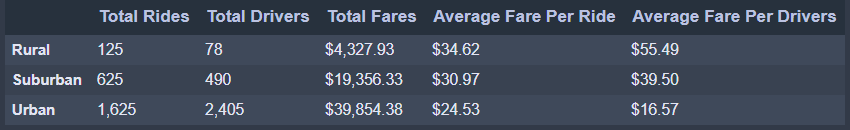
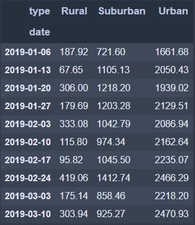
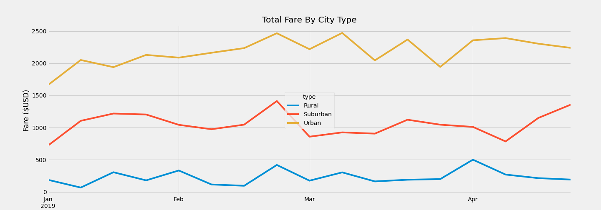

# PyBer_Analysis, challenge_5
## overview
The purpose of this report is to show how the data differs by city type and how those differences can be used for decision taking at PyBer.  A summary DataFrame of the ride-sharing data by city type is shown. Then, using Pandas and Matplotlib, a multiple-line graph was created in order to show the total weekly fares for each city type. A discussion and analysis on these images is developed

## Results

  

  

  

## summary
